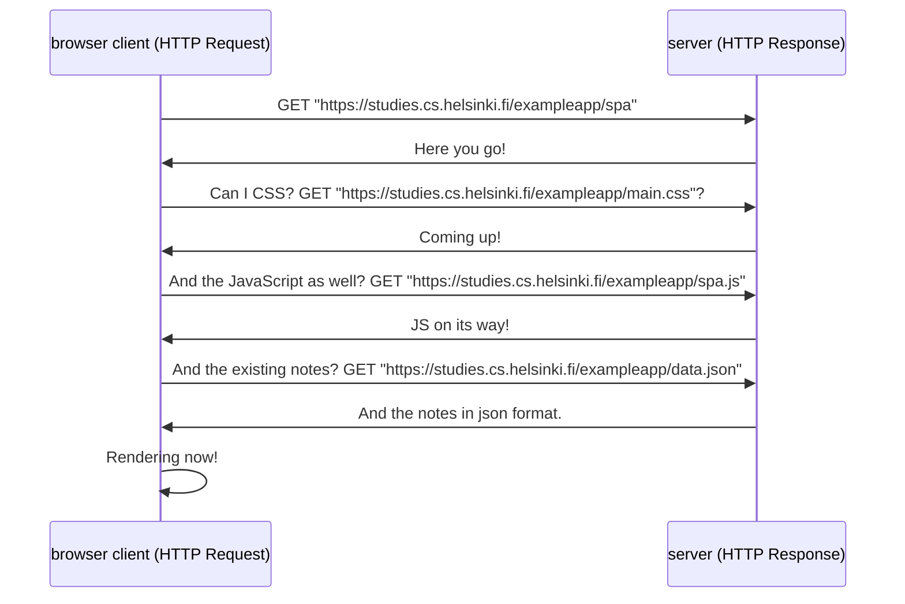

#TEHTÄVÄ 0.5 - SPA (Single Page Application), sivun lataaminen

```mermaid
  sequenceDiagram
  participant bc as browser client (HTTP Request)
  participant s as server (HTTP Response)  

  bc->>s: GET "https://studies.cs.helsinki.fi/exampleapp/spa"
  s->>bc: Here you go!
  bc->>s: Can I CSS? GET "https://studies.cs.helsinki.fi/exampleapp/main.css"?
  s->>bc: Coming up!
  bc->>s: And the JavaScript as well? GET "https://studies.cs.helsinki.fi/exampleapp/spa.js"
  s->>bc: JS on its way!
  bc->>s: And the existing notes? GET "https://studies.cs.helsinki.fi/exampleapp/data.json"
  s->>bc: And the notes in json format.
  bc->>bc: Rendering now!
```
