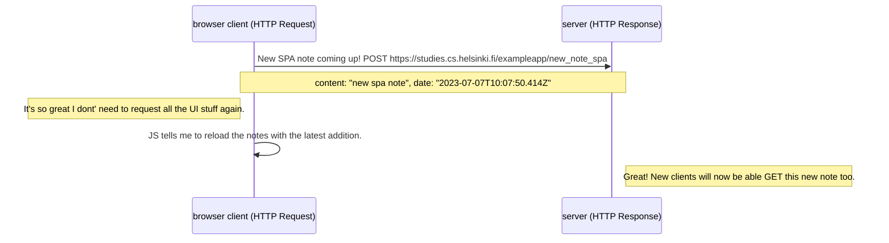

#TEHTÄVÄ 0.5 - SPA - uuden muistiinpanon lähetys (Single Page Application)

### In this solution, all clients wont' be in sync without refreshing the page
If there are multiple clients posting new notes, they will see only the contents they received in the json file they loaded last.
They will see their own new posts, but not others' who are posting at the same time.
To see the latest posts, a new GET request to the web server is required.
