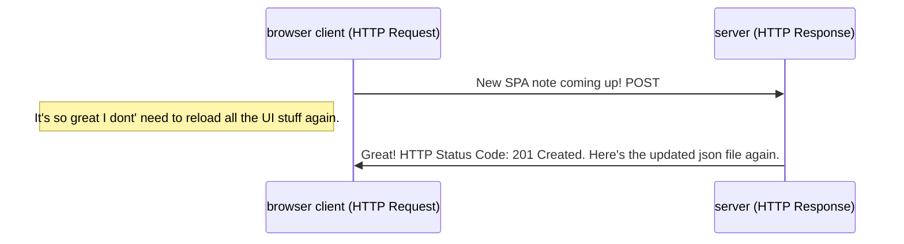

#TEHTÄVÄ 0.5 - SPA - uuden muistiinpanon lähetys (Single Page Application)

```mermaid
  sequenceDiagram
  participant bc as browser client (HTTP Request)
  participant s as server (HTTP Response)  

  bc->>s: New SPA note coming up! POST
  Note left of bc: It's so great I dont' need to reload all the UI stuff again.
  s->>bc: Great! HTTP Status Code: 201 Created. Here's the updated json file again.

```
