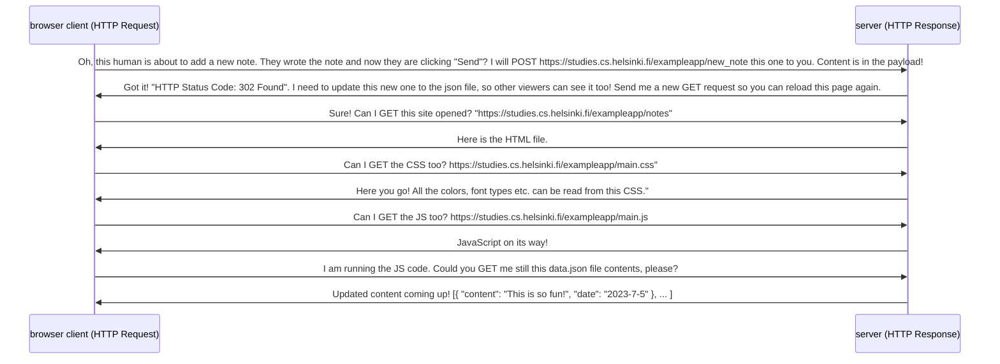

#TEHTÄVÄ 0.4 - Notes-sivu - uuden muistiinpanon lähetys (POST + GET)

```mermaid
  sequenceDiagram
  participant bc as browser client (HTTP Request)
  participant s as server (HTTP Response)  

  bc->>s: Oh, this human is about to add a new note. They wrote the note and now they are clicking "Send"? I will POST https://studies.cs.helsinki.fi/exampleapp/new_note this one to you. Content is in the payload!
  s->>bc: Got it! "HTTP Status Code: 302 Found". I need to update this new one to the json file, so other viewers can see it too! Send me a new GET request so you can reload this page again.
  bc->>s: Sure! Can I GET this site opened? "https://studies.cs.helsinki.fi/exampleapp/notes"
  s->>bc: Here is the HTML file.
  bc->>s: Can I GET the CSS too? https://studies.cs.helsinki.fi/exampleapp/main.css"
  s->>bc: Here you go! All the colors, font types etc. can be read from this CSS."
  bc->>s: Can I GET the JS too? https://studies.cs.helsinki.fi/exampleapp/main.js
  s->>bc: JavaScript on its way!
  bc->>s: I am running the JS code. Could you GET me still this data.json file contents, please?
  s->>bc: Updated content coming up! [{ "content": "This is so fun!", "date": "2023-7-5" }, ... ]  


```
