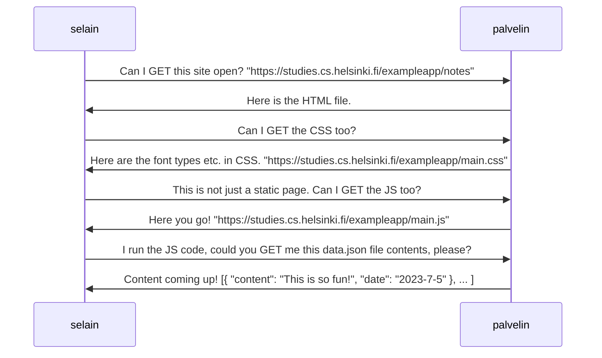

#Notes-sivun lataus ja uuden muistiinpanon lähetys

```mermaid
  sequenceDiagram
  participant s as selain
  participant p as palvelin   

  s->>p: Can I GET this site open? "https://studies.cs.helsinki.fi/exampleapp/notes"
  p->>s: Here is the HTML file.
  s->>p: Can I GET the CSS too?
  p->>s: Here are the font types etc. in CSS. "https://studies.cs.helsinki.fi/exampleapp/main.css"
  s->>p: This is not just a static page. Can I GET the JS too?
  p->>s: Here you go! "https://studies.cs.helsinki.fi/exampleapp/main.js"
  s->>p: I run the JS code, could you GET me this data.json file contents, please?
  p->>s: Content coming up! [{ "content": "This is so fun!", "date": "2023-7-5" }, ... ]
    
```
