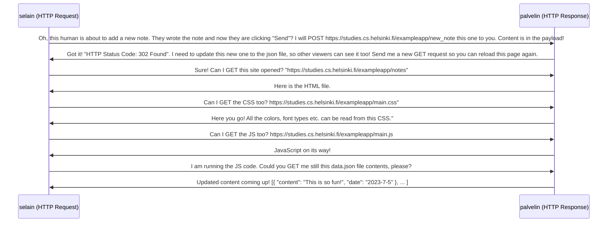

#Notes-sivu - uuden muistiinpanon lähetys (POST + GET)

```mermaid
  sequenceDiagram
  participant s as selain (HTTP Request)
  participant p as palvelin (HTTP Response)  

  s->>p: Oh, this human is about to add a new note. They wrote the note and now they are clicking "Send"? I will POST https://studies.cs.helsinki.fi/exampleapp/new_note this one to you. Content is in the payload!
  p->>s: Got it! "HTTP Status Code: 302 Found". I need to update this new one to the json file, so other viewers can see it too! Send me a new GET request so you can reload this page again.
  s->>p: Sure! Can I GET this site opened? "https://studies.cs.helsinki.fi/exampleapp/notes"
  p->>s: Here is the HTML file.
  s->>p: Can I GET the CSS too? https://studies.cs.helsinki.fi/exampleapp/main.css"
  p->>s: Here you go! All the colors, font types etc. can be read from this CSS."
  s->>p: Can I GET the JS too? https://studies.cs.helsinki.fi/exampleapp/main.js
  p->>s: JavaScript on its way!
  s->>p: I am running the JS code. Could you GET me still this data.json file contents, please?
  p->>s: Updated content coming up! [{ "content": "This is so fun!", "date": "2023-7-5" }, ... ]  


```
